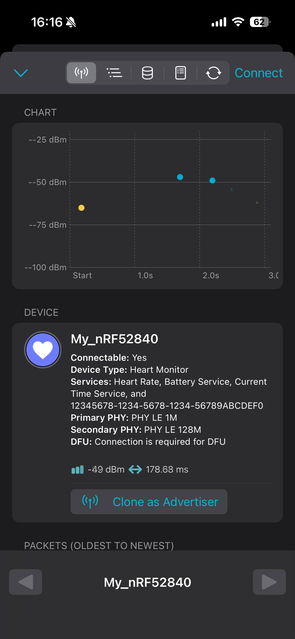
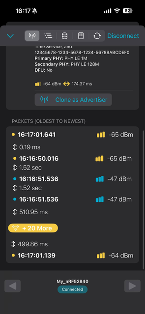
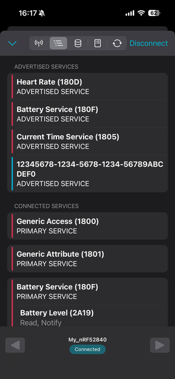
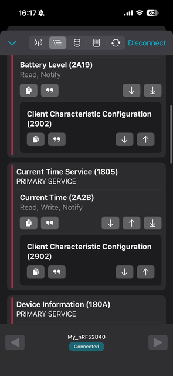
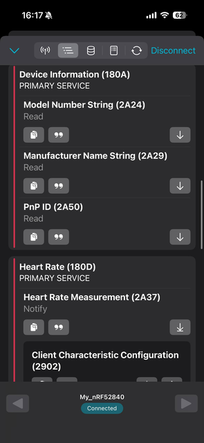
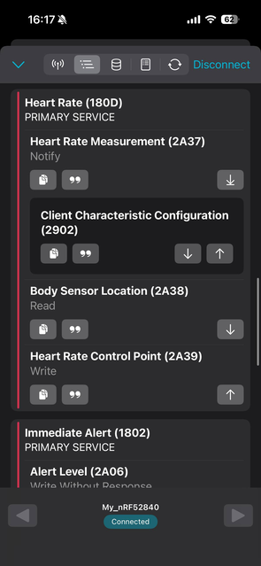
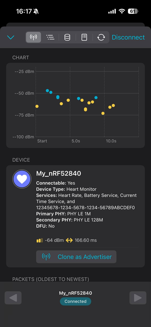
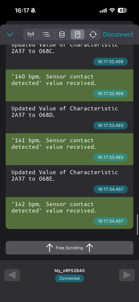
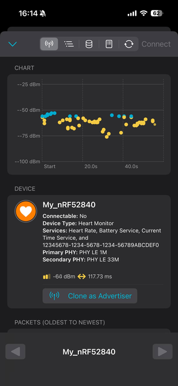

# Task 6 - nRF52840 DK Overview and BLE Advertising Setup 

**Course:** ENCE 4709 – Microcontrollers: Interface & Programming
**Instructor:** Dr. Alexz Farrall  
**Task Number & Title:** Task 6 - nRF52840 DK Overview and BLE Advertising Setup 
**Full name:** Farid Ibadov  
**Student ID:** 17954  
**Date:** May, 2026  

---

### 1. Objective

The goal of this lab was to thoroughly explore the nRF52840 development kit, understand why it's particularly suitable for working with the BLE protocol, and document the process of configuring it as a BLE advertiser. In our case, the board was used as a BLE peripheral, while a phone running the proprietary nRF Connect app served as a scanner and central device.

Before diving into the actual code, it's important to understand how the protocol works and why BLE advertising is the initial, and perhaps most important, step before establishing a final connection between the two parties. The board periodically sends short advertising packets, which nearby devices can detect without first establishing a connection. If the advertiser is available and doesn't object, the scanner can later connect and check for GATT services.

### 2. Device Overview

The nRF52840 DK is a development board based on the Nordic nRF52840 SoC. It's well-suited for this lab because it already features a built-in BLE radio module, a small antenna, a built-in debugger, a USB interface, buttons, LEDs, and numerous accessible connectors. Nordic is widely known for its boards, which are leaders in the BLE market. We won't need any additional wiring just to test a standard BLE ad - we connect the board via USB, compile the firmware, flash it, and then simply watch the ad from our phone.

Board has multiple useful parts for this lab:

- nRF52840 SoC - runs the app and the BLE stack itself.
- 2.4 GHz antenna - transmits and receives BLE packets.
- SEGGER J-Link debugger - used for flashing and debugging.
- USB port - provides power and a programming interface.
- Buttons and LEDs - useful for routine testing of embedded systems.
- Arduino-style headers - useful if external modules are later required for more advanced projects.


### 3. BLE Advertising Idea


Bluetooth Low Energy operates in the 2.4 GHz ISM frequency band. For detection, BLE uses three main advertising channels: 37, 38, and 39. These frequencies were specifically selected to minimize conflicts with frequencies used by other signals, such as Wi-Fi, since otherwise, the system's performance would degrade. The advertiser sends advertising packets only on these channels, and the scanner detects and receives them. The advertising interval is also important, especially if the module is used in battery-powered nodes, where system power consumption is a key factor. A shorter interval means the board is detected faster, but the radio module is turned on much more frequently, which can increase battery consumption. A longer interval, on the other hand, significantly reduces power consumption, but detection can take several times longer. Therefore, in a well-designed system, depending on its intended use, finding a balance between these two factors is key.

BLE advertising interval has the minimum step of 0.625 ms. So for 500 ms:

$$
\frac{500}{0.625} = 800
$$

$$
800_{10} = 0x0320
$$

`0x0320` is the interval value for approximately 500 ms advertising.

### 4. Software Used

For the following task we have used:
	- Visual Studio Code
	- nRF Connect extension
	- nRF Connect SDK
	- Zephyr RTOS
	- nRF Connect mobile application

The main project files are:

- `main.c` - with BLE application logic.
- `prj.conf` - enables Bluetooth features and sets main configuration options, such as name.

### 5. Workflow

1. First, we connect the nRF52840 DK to the computer using USB. This powers the board and exposes the onboard J-Link debugger. It's important to set the power switch to the correct position - in our case, USB - since the board is powered and connected via the computer's USB port.

	

2. Then, open VS Code and use the nRF Connect extension with all the ready-made tools that make using this board much easier. Click on "Create a new application" and continue


3. We choose to create a project based on an existing example. This is very convenient, as the BLE example already contains all the basic Zephyr structure we need for our lab task. Click "Copy a sample" and go on.


4. With a huge number of ready-made examples available, for our lab task we only need a standard Bluetooth LE example. To do this, point and click on the icon marked with an arrow.


5. Before assembly, we select the board from a large list of other different boards to ensure compatibility with the project: `nrf52840dk_nrf52840`. This is important because Zephyr generates firmware based on the selected board. If the board isn't compatible, the firmware may not match the hardware, and the program won't work.


6. As soon as the project appears in the nRF Connect extension, we immediately add our build configuration.


7. After this, we create and implement our project.


8. Finally, we flash the firmware to our board.


### 6. Task 6 Result

At this point, the board was successfully prepared as a BLE advertising device. No external components were required for setup, since, as previously mentioned, the nRF52840 DK already includes a BLE radio and debugger. The demonstrated workflow also confirmed that the project was created for the correct target board and that successfully building and flashing the BLE example is straightforward. The only time-consuming step is the initial installation of all the expansion packages and files, which together can be tens of gigabytes in size.

---

# Task 7 - BLE Project Build, Connection Verification, and Code Analysis

**Course:** ENCE 4709 – Microcontrollers: Interface & Programming
**Instructor:** Dr. Alexz Farrall  
**Task Number & Title:** Task 7 - BLE Project Build, Connection Verification, and Code Analysis
**Full name:** Farid Ibadov  
**Student ID:** 17954  
**Date:** May, 2026  

---

### 1. Objective

The goal of this lab was to run a BLE example on the nRF52840 DK board, test the board in the nRF Connect mobile app, and explain how the code works. Unlike the previous lab, this one covers a more practical part, including pre- and post-connection processes.

Before connection, we should only see advertising information about the peripheral, such as the device name, RSSI, MAC address, advertised services, and connection status, as there are BLE modes in which connection is by design impossible. After connection, we should be able to open arguably the most important BLE protocol, the GATT server, and check the services and characteristics it provides.

### 2. Advertising Verification Before the Connection

After flashing the firmware, the board immediately began transmitting data automatically. We opened the nRF Connect app and, after searching for nearby BLE devices, easily found our board broadcasting advertisement packets.


Once the board is detected via the BLE protocol, the Connect button immediately becomes visible, indicating that the device was advertising the data in connectable mode. The RSSI value, indicating the power of the signal in dBm, also confirms that the phone is receiving a real radio signal from the board. The higher dBm (-48 is bigger that -92), the stronger and more stable the signal.

### 3. Code Structure

We are interested in two files, where modifications are done:

- `main.c`
- `prj.conf`

The `prj.conf` file includes Bluetooth and the services used by the example. The `main.c` file contains the advertising data itself, scan response data, GATT service definitions, connection callbacks, and the main loop.

```c
int main(void)
{
    err = bt_enable(NULL);
    if (err) {
        printk("Bluetooth init failed (err %d)\n", err);
        return 0;
    }

    bt_ready();
    bt_cts_init(&cts_cb);
    bt_hrs_cb_register(&hrs_cb);

    bt_gatt_cb_register(&gatt_callbacks);
    bt_conn_auth_cb_register(&auth_cb_display);

    vnd_ind_attr = bt_gatt_find_by_uuid(vnd_svc.attrs, vnd_svc.attr_count,
                                        &vnd_enc_uuid.uuid);
    bt_uuid_to_str(&vnd_enc_uuid.uuid, str, sizeof(str));
    printk("Indicate VND attr %p (UUID %s)\n", vnd_ind_attr, str);

    /* Implement notification. At the moment there is no suitable way
     * of starting delayed work so we do it here
     */
    while (1) {
        k_sleep(K_SECONDS(1));

        /* Current time update notification example
         * For testing purposes, we send a manual update notification every second.
         * In production `bt_cts_send_notification` should only be used when time is changed
         */
        if (cts_notification_enabled) {
            bt_cts_send_notification(BT_CTS_UPDATE_REASON_MANUAL);
        }

        /* Heartrate measurements simulation */
        hrs_notify();

        /* Battery level simulation */
        bas_notify();

        /* Vendor indication simulation */
        if (simulate_vnd && vnd_ind_attr) {
            if (indicating) {
                continue;
            }

            ind_params.attr = vnd_ind_attr;
            ind_params.func = indicate_cb;
            ind_params.destroy = indicate_destroy;
            ind_params.data = &indicating;
            ind_params.len = sizeof(indicating);

            if (bt_gatt_indicate(NULL, &ind_params) == 0) {
                indicating = 1U;
            }
        }
    }

    return 0;
}
```

### 4. Execution Order in `main()`

The program starts from `main()`. The first important call is:

```c
err = bt_enable(NULL);
if (err) {
    printk("Bluetooth init failed (err %d)\n", err);
    return 0;
}
```

This line initializes the entire Bluetooth subsystem. If a failure occurs, the program immediately displays an error message and does not continue broadcasting BLE advertisements. This order is essential, as advertising should not begin until the Bluetooth stack is enabled.

After Bluetooth is initialized, the code calls `bt_ready();`:

```c
bt_ready();
```

Inside `bt_ready()`, program loads saved settings (if they are enabled) and directly starts advertising.

```c
static void bt_ready(void)
{
    int err;

    printk("Bluetooth initialized\n");

    if (IS_ENABLED(CONFIG_SETTINGS)) {
        settings_load();
    }

    err = bt_le_adv_start(BT_LE_ADV_CONN_FAST_1, ad, ARRAY_SIZE(ad), sd, ARRAY_SIZE(sd));
    if (err) {
        printk("Advertising failed to start (err %d)\n", err);
        return;
    }

    printk("Advertising successfully started\n");
}
```

### 5. Advertising Data and Scan Response

While advertising data is stored in `ad[]`, scan response data is stored in `sd[]`.

```c
static const struct bt_data ad[] = {
    BT_DATA_BYTES(BT_DATA_FLAGS, (BT_LE_AD_GENERAL | BT_LE_AD_NO_BREDR)),
    BT_DATA_BYTES(BT_DATA_UUID16_ALL,
                  BT_UUID_16_ENCODE(BT_UUID_HRS_VAL),
                  BT_UUID_16_ENCODE(BT_UUID_BAS_VAL),
                  BT_UUID_16_ENCODE(BT_UUID_CTS_VAL)),
    BT_DATA_BYTES(BT_DATA_UUID128_ALL, BT_UUID_CUSTOM_SERVICE_VAL),
};

static const struct bt_data sd[] = {
    BT_DATA(BT_DATA_NAME_COMPLETE, CONFIG_BT_DEVICE_NAME, sizeof(CONFIG_BT_DEVICE_NAME) - 1),
};
```

Main advertising data includes:

1. BLE flags,
2. 16-bit UUIDs for standard services,
3. 128-bit UUID for the custom vendor service.

Scan response contains the complete device name from `CONFIG_BT_DEVICE_NAME` which is located in the `prj.conf` file. Since the payload size of BLE advertising is limited, the information is divided, and some data is only visible to the central after a scan response is received in response to a scan request.
### 6. Connection Verification

After pressing the Connect button in nRF Connect, the phone established a BLE connection with the board. Up until this point, the phone had only been listening for advertising packets. Once the connection was established, it was able to access the GATT server, which opens a range of data access options.









Here we can open a service and view corresponding characteristics, like Heart Rate Service which belongs to the SIG services (Special Interest Group).





We can also observe that, Heart Rate Service may send Heart Rate Measurement as Notify, which automatically pushes data to central device, not expecting an acknowledgement.


As an addition, we can see the statics of the power of the connection signal, whether it intensified or degraded.



Here we can observe that one can subscribe to some services and see the live data sent from a peripheral. Since this is just a simulation, those values do not represent anything crucial, but are used as a template for display, showing capabilities of the system.



### 7. GATT Data Behavior

As mentioned earlier, the code simulates several services. Inside an infinite loop, the program sleeps for one second, then updates values such as heart rate and battery level.

```c
while (1) {
    k_sleep(K_SECONDS(1));
    hrs_notify();
    bas_notify();
}
```

This is why we can observe data changes on the phone after connecting to the peripheral. Advertising only makes the panel visible, while GATT services are used after connection to display data and characteristics in real time.

### 8. Scannable Non-Connectable Test

By default, the example was set to connectable mode, but if we want to change the mode, we need to return to the `bt_ready()` function and access the parameters passed to the `bt_le_adv_start()` function:

```c
err = bt_le_adv_start(BT_LE_ADV_OPT_SCANNABLE, ad, ARRAY_SIZE(ad), sd, ARRAY_SIZE(sd));
if (err) {
    printk("Advertising failed to start (err %d)\n", err);
    return;
}
```

By changing the mode to scannable but non-connectable, the peripheral can still advertise and respond with scan response data, but the central cannot establish a connection. After flashing the code, or pressing restart button on the board, the button to connect becomes non-interactive, though peripheral is still visible.



### 9. Task 7 Result

Task 7 was successfully completed, as the board showed up in the scanner, connected successfully to the phone, and, once connected, provided access to numerous GATT services. The screenshots confirm the difference between the advertising state and the connected state. And code analysis shows the correct sequence: 

Bluetooth initialization -> advertising -> updating GATT services in the main loop.

---

# Task 8 - Device Name and Advertising Interval Modification

**Course:** ENCE 4709 – Microcontrollers: Interface & Programming
**Instructor:** Dr. Alexz Farrall  
**Task Number & Title:** Task 8 - Device Name and Advertising Interval Modification
**Full name:** Farid Ibadov  
**Student ID:** 17954  
**Date:** May, 2026  

### 1. Objective

The objective of this lab task was even simpler - to modify the BLE sample through changing the advertised device name and setting the advertising interval to 500 ms. This change directly affects the BLE's behavior

### 2. Changing the Device Name

The device name is changed in `prj.conf` using:

```conf
CONFIG_BT_DEVICE_NAME="My_nRF52840"
```

### 3. Changing the Advertising Interval

To set the advertising interval to 500 ms, we added:

```c
#define ADV_INTERVAL_500MS 0x0320
```

Value is used both as minimum and maximum advertising interval inside `BT_LE_ADV_PARAM(...)`.

```c
#define ADV_INTERVAL_500MS 0x0320

static void bt_ready(void)
{
    int err;

    printk("Bluetooth initialized\n");

    if (IS_ENABLED(CONFIG_SETTINGS)) {
        settings_load();
    }

    err = bt_le_adv_start(
        BT_LE_ADV_PARAM(BT_LE_ADV_OPT_CONN,
                        ADV_INTERVAL_500MS,
                        ADV_INTERVAL_500MS,
                        NULL),
        ad, ARRAY_SIZE(ad),
        sd, ARRAY_SIZE(sd));

    if (err) {
        printk("Advertising failed to start (err %d)\n", err);
        return;
    }

    printk("Advertising successfully started\n");
}
```

$$
1 \text{ BLE interval unit} = 0.625 \text{ ms}
$$

$$
\frac{500 \text{ ms}}{0.625 \text{ ms}} = 800
$$

$$
800_{10} = 0x0320
$$

So `0x0320` corresponds to a 500 ms advertising interval.

### 4. Why This Produces the Expected Result

`BT_LE_ADV_PARAM(...)` creates the advertising parameter structure which `bt_le_adv_start()` uses. Inside it, we define:

- advertising option -> connectable advertising,
- min advertising interval -> 500 ms,
- max advertising interval -> 500 ms,
- peer address - `NULL`, because this is not directed advertising.

Since the minimum and maximum interval values ​​are equal, approximately the same advertising message transmission interval is used each time, excluding the normal random BLE delay.

### 5. Task 8 Result

Task 8 was successfully completed because the device name changed in the scanner (this could be seen in the previous screenshots, as we had already changed the name when they were taken), and the advertising message transmission interval was adjusted using the correct BLE unit conversion. The final code ensures that the board can be connected when the advertising message transmission interval is changed to 500 ms.
